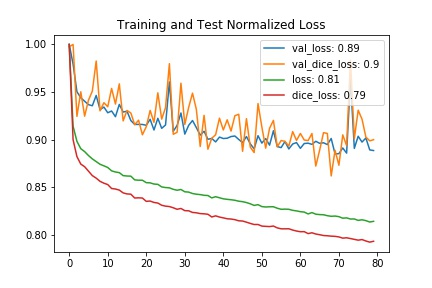
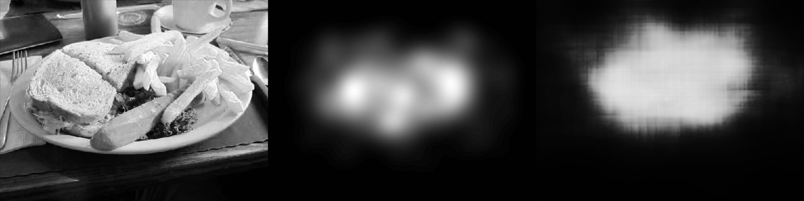
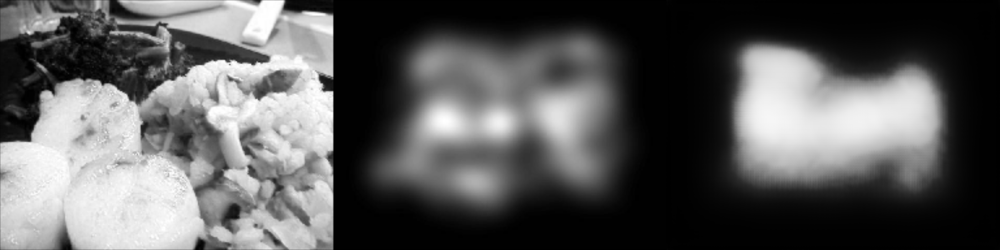
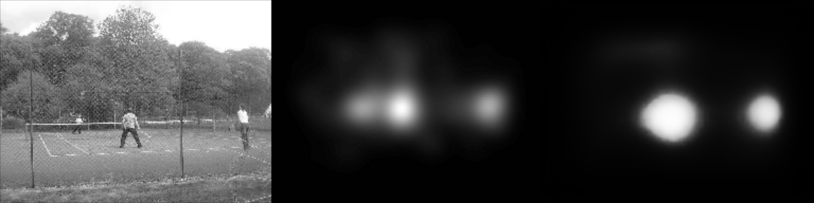
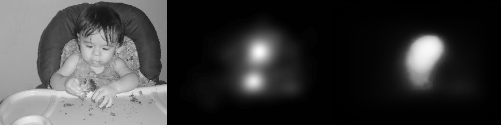
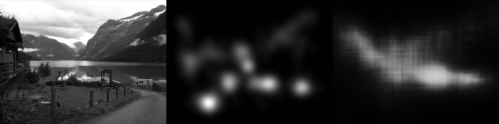
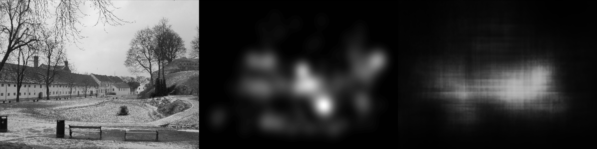
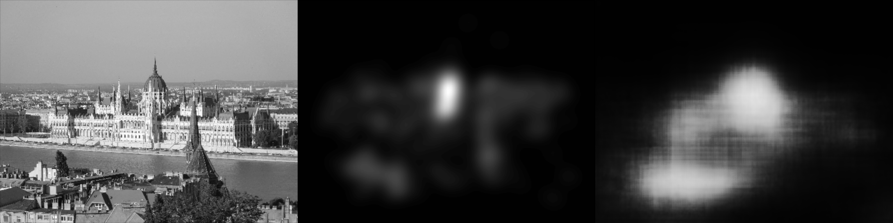

# analysis_images

The gitlab repository for the Mashine Learning in image analysis. 

* Clone repository
* feature_analyse_project:
    * `we analyse the part of the feature activation from a pretrained CNN`
	* `Question is are there any correlation between experiment type and feature activation?`
	
* medical_image_sequence:
    * `classify medical image sequences with CNN-LSTM classifier.`
	
	
* pca_project:
    * `search for correlation of the 10000 features in CNN`
 
* unet_project:
    * `generating Eye movement with kernel Density Estimation.`

	
	
	
Left: Input  Middle: Label  Right: Output
	
* Train:
	
	
	
	
	
	
	
	
	
* Test:
	
	
	
	
	
	
	

	
