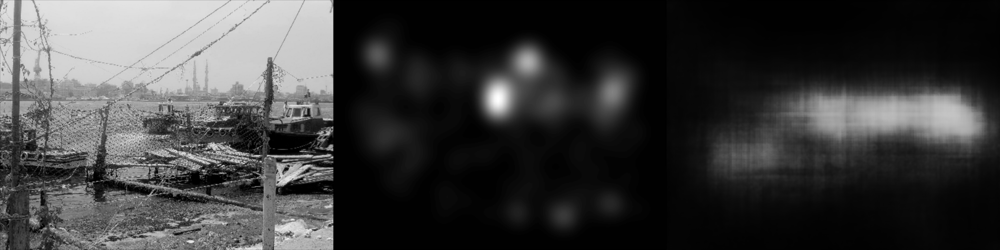

# analysis_images

The gitlab repository for the Mashin Learning Eye Movement

* Clone repository
* feature_analyse_project:
    * `we analyse the part of the feature activation from CNN`

* pca_project:
    * `search for correlation of the 10000 features in CNN`
 
* unet_project:
    * `generating Eye movement with kernel Density Estimation.`
	
	* Loss:
	
	
	* Train:
	
	
	
	
	
	
	
	
	
	* Test:
	
	
	
	
	
	
	
		
	